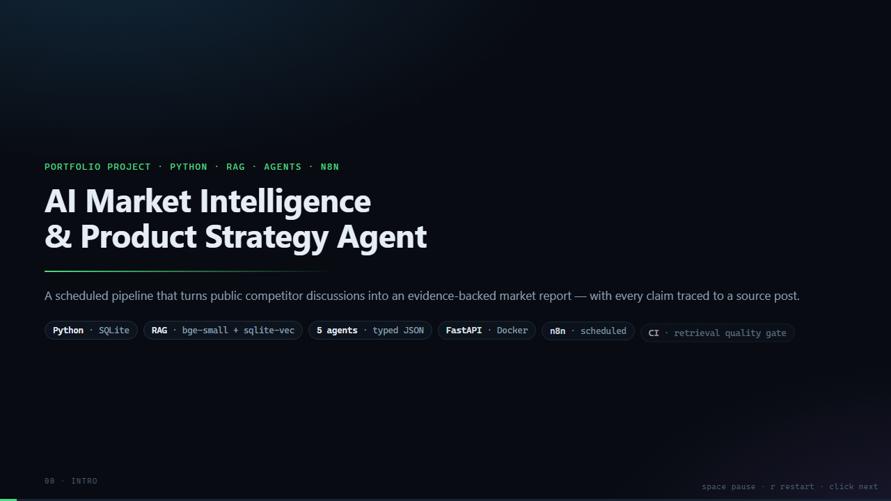

# AI Market Intelligence & Product Strategy Agent

Monitors e-commerce platform competitors (**Shopify, WooCommerce,
BigCommerce**) and will generate evidence-backed product opportunities
and PRDs. Built incrementally, phase by phase.

## Phase 1: data pipeline — fetch → clean → store

Collects public discussions about each competitor into a local SQLite
database, ready for the RAG / analysis stages.

**Data source:** Hacker News via the [Algolia API](https://hn.algolia.com/api)
— public, no auth required. (Reddit's public JSON API now requires OAuth
app credentials, so the pipeline was kept source-agnostic to add it later.)

## Phase 2: RAG foundation — chunk → embed → vector search

Reads the stored posts, splits them into overlapping chunks, embeds
each chunk with a **local** model (bge-small-en-v1.5 via fastembed — no
API key, no cost), and stores the vectors in SQLite next to the posts.
`run_search.py` ranks chunks by cosine similarity and prints the source
URL with each hit (the citation chain).

```bash
python run_index.py                        # build/refresh the vector index
python run_search.py "shopify checkout fees"
python run_search.py "migrating away from shopify" --competitor shopify
python run_search.py                       # interactive mode
```

The embeddings live in the same SQLite file, indexed by a real vector
index — the **sqlite-vec** extension's `vec0` virtual table (k-NN search,
`distance_metric=cosine`), alongside the `chunks` metadata table. The
`--competitor` filter is applied as a SQL join after the scan, since
`vec0` cannot filter on non-vector columns; a scan covers the whole
corpus so results match a global cosine ranking exactly.

The vector index has a **regression test suite** (`tests/`) that pins
sqlite-vec's results to a reference numpy cosine ranking — the exact
algorithm the index replaced. It covers ranking, the competitor filter
(including the post-filter bug scenario), tie-breaking between
byte-identical chunks (reposted articles), and an empty corpus.

```bash
pip install -r requirements-dev.txt
python -m pytest tests/ -v
```

(First run downloads the embedding model once; it is cached afterwards,
same as `python run_index.py`.)

## Phase 3: grounded Q&A — retrieve → answer → cite

Closes the RAG loop: `run_ask.py` retrieves the top chunks for a
question, asks an LLM to answer **using only that evidence**, and prints
the sources it cited. Anti-hallucination is layered — the model sees
numbered evidence only, is told to cite inline as [n], and every [n] is
post-validated against the sources actually retrieved.

```bash
python run_ask.py "Why do app developers complain about Shopify?"
python run_ask.py "What should I consider before switching platforms?" --top 4
python run_ask.py                                   # interactive mode
```

The model provider is pluggable over any OpenAI-compatible endpoint and
auto-detected: a local **Ollama** server (free, no key) if reachable,
otherwise the **OpenAI API** when `OPENAI_API_KEY` is set. Override with
`LLM_PROVIDER=openai|ollama|custom` or `--provider`. Credentials live in
the environment, never in the code. On machines where Ollama's GPU
(Vulkan) discovery hangs, start it with `OLLAMA_VULKAN=false`.

## Phase 4: multi-agent layer — research → analyze → strategize → fact-check

Turns the knowledge base into a market report. Five agents, one job
each, all working from the vector index (never raw text):

```text
research   -> plans search queries from the brief, gathers numbered evidence
competitor -> analyzes each competitor: positioning/pricing, strengths, weaknesses
customer   -> complaints, pain points, and praise from the community
strategy   -> ranked product opportunities, risks, next step — all cited
critic     -> fact-checks the draft against the evidence, flags unsupported claims
```

```bash
python run_report.py "fees and developer payouts"
python run_report.py "why merchants switch platforms" --competitors shopify woocommerce
python run_report.py "checkout friction" --out my_report.md
```

The report lands in `data/reports/` (or `--out`) with a sources section
mapping every citation number back to a URL. Anti-hallucination is the
same layered defense as Phase 3, at report scale: every agent must cite
numbered evidence, the critic judges *support* claim by claim, and a
mechanical audit (code, not LLM) verifies every [n] points at evidence
that was actually retrieved — including a warning when a draft cites
nothing at all.

The agents reply in **structured JSON** (claims with citation numbers;
verdicts keyed by claim id), so the report renders from typed data
instead of free-text markdown. The parsing layer is deliberately
defensive: replies are extracted tolerantly (fences, preamble, trailing
commentary), validated and normalized, retried once on malformed JSON,
and a section that still fails falls back to free text and is flagged
in the report's audit — the pipeline never crashes on a bad model
reply. Verdict counts come from the typed data (code-counted), never
from the model's own arithmetic.

Honest limits to know: a small local model (e.g. llama3.2:3b) produces
generic analyst prose and a critic that over-flags subjective-but-
accurate claims, so read reports critically — and the same model on a
CPU-only machine makes a full report take several minutes. Both are
better with a stronger model and faster hardware; the architecture is
provider-agnostic.

## Evaluation harness

Scores the RAG pipeline against hand-labeled questions
(`tests/fixtures/eval_questions.json`, each labeling which posts are
relevant):

- **retrieval** — precision@k, recall@k, MRR, nDCG@k of the vector
  index's top-k
- **answer** (`--with-answers`) — citation precision/recall of the LLM
  answer: of the posts it cites, how many are relevant, and of the
  relevant posts, how many got cited

```bash
python run_eval.py                    # retrieval only — fast, no LLM, CI-safe
python run_eval.py --with-answers     # + LLM answers and citation scores
python run_eval.py --with-answers --limit 4
python run_eval.py --top 8 --out data/reports/eval_report.md
python run_eval.py --db /tmp/ci.db    # score a different corpus
python run_eval.py --min-mrr 0.8 --min-recall 0.7   # quality gate (exit 1)
python run_eval.py --summary          # also render on the CI run page
```

The markdown report lands in `data/reports/`. Retrieval-only runs need
no LLM at all, so they can gate CI on every push; answer runs need the
same provider as `run_ask.py`. `--min-mrr` / `--min-recall` turn a run
into a gate: the process exits 1 if an average drops below the
threshold, which is exactly how CI fails a regression. `--summary`
appends the report and the gate outcome to `$GITHUB_STEP_SUMMARY`, so
the numbers appear on the run page — including when the gate fails —
instead of only inside a downloaded artifact.

The corpus itself is gitignored, so `run_corpus.py` can move it in and
out of the repo as plain JSON — `export` dumps the cleaned posts (text
only, no embeddings) and `seed` rebuilds a DB plus vector index from
them, re-embedding with the local model:

```bash
python run_corpus.py export                  # DB -> tests/fixtures/ci_corpus.json
python run_corpus.py seed --db /tmp/ci.db    # fixture -> fresh DB + index
```

## Continuous integration

`.github/workflows/ci.yml` runs on every push, PR, and manual dispatch,
in one job:

1. **test suite** — `python -m pytest tests/` (85 tests: sqlite-vec vs
   numpy regression, agent plumbing, metric math, API and job
   behaviour, fetch retry/backoff)
2. **retrieval-only eval** — rebuilds the corpus from
   `tests/fixtures/ci_corpus.json` via `run_corpus.py seed`, then runs
   `run_eval.py --min-mrr 0.8 --min-recall 0.7 --summary`, which renders
   the report and gate outcome on the run page and also uploads it as a
   build artifact

Two details make it work without secrets or network flakiness: the
corpus is seeded from the checked-in fixture (no Hacker News calls), and
retrieval needs no LLM — so the job is deterministic and runs on a
public runner. The one download is the bge-small model, cached between
runs via `actions/cache` keyed on `requirements.txt`.

### Tests must not depend on your machine

The suite passes on a runner with nothing running, and that is enforced
rather than assumed. `/ask` and `/reports` auto-detect the LLM provider
per request by probing localhost:11434, so a laptop with Ollama up takes
a different code path than CI — which is exactly how the *first* CI run
failed: 7 tests in `tests/test_api.py` got 503s that could never fail
locally. The `client` fixture now pins the provider, and a guard test
fails if that pin is ever dropped. To reproduce the runner's conditions:

```bash
PYTHONPATH=tests python -m pytest tests/ -p ci_sim_plugin -q
```

`tests/ci_sim_plugin.py` hides every ambient provider — nothing listening
on the LLM port and no `OPENAI_API_KEY`. It is never loaded implicitly,
so a plain `pytest tests/` is unaffected.

## Run

```bash
python -m venv .venv
# Windows:  .venv\Scripts\python -m pip install -r requirements.txt
# macOS/Linux: .venv/bin/python -m pip install -r requirements.txt
python run_pipeline.py [--limit 25]
python run_index.py
python run_api.py            # http://127.0.0.1:8000/docs
```

## Phase 5: n8n orchestration — schedule, notify, recover

n8n owns the business workflow: when a run happens, what to do when it
fails, and who gets told. Python owns the intelligence. They meet at the
HTTP API — n8n never imports this code, and this code never knows n8n
exists. Two importable workflows in `n8n/` (see `n8n/README.md`):

```text
06:00  corpus_refresh.json  POST /pipeline/refresh -> poll  (fetch, clean, store, reindex)
07:00  market_report.json   POST /reports           -> poll  (five agents -> report)
                            then: Slack summary, or a no-op
```

The reason both look like *start a job, then poll* is not stylistic: a
full report is minutes of LLM work. An n8n HTTP node held open for that
would time out and **retry**, running the whole pipeline twice. So the
API returns `202` with a job id and the workflow polls `GET /jobs/{id}`
on a Wait node. A single Code node maps job state to
`wait`/`done`/`failed`/`timeout` and carries the attempt counter, so the
loop condition lives in one place; bounded attempts turn a wedged API
into a Slack alert instead of an execution that never ends. The refresh
notifies only when it actually found something — a daily "0 new posts"
message just trains people to mute the channel.

The Slack webhook comes from an environment variable, so the exported
workflow JSON is safe to commit. Full setup in `n8n/README.md`.

## Phase 6: the service and its container

`market_intel/api.py` exposes the whole pipeline over HTTP, so something
other than a human can drive it:

| endpoint | what it does |
|---|---|
| `GET /health` | corpus size, embedding model, whether an LLM is reachable |
| `POST /search` | semantic search over the vector index |
| `POST /ask` | evidence-backed answer + validated citations |
| `POST /reports` | queue a market report → `202` + job id |
| `POST /pipeline/refresh` | queue a corpus refresh → `202` + job id |
| `GET /jobs`, `/jobs/latest`, `/jobs/{id}` | job status + typed result |
| `GET /jobs/{id}/markdown` | the rendered report |
| `POST /eval` | retrieval metrics against the labeled questions |

```bash
python run_api.py                       # local
python run_api.py --host 0.0.0.0        # in a container
curl -s -X POST localhost:8000/reports -H 'content-type: application/json' \
  -d '{"brief":"fees and developer payouts"}'
```

Production habits this phase adds, all of them visible in the code:

- **Jobs, not open connections.** Both long operations return a job id;
  one worker by default, because the pipeline is CPU-bound and a second
  concurrent report only slows the first.
- **A request id on every log line**, echoed back in `X-Request-ID`. The
  job worker copies the submitting request's context into its thread, so
  a report started at 09:00 still logs under the id its caller was given.
- **Errors carry the request id** and never leak a traceback; `/health`
  reports an unreachable LLM instead of failing, because a health check
  that 500s is a health check you cannot read.
- **Config from the environment** (`.env.example` documents every knob).

```bash
docker compose up --build       # api + local Ollama, model baked in
```

The image installs dependencies first (cacheable layer), **smoke-tests
sqlite-vec at build time** (loading the extension depends on the host
SQLite build — better a failed build than a failed first search), bakes
the embedding model in so a cold container answers immediately, and runs
as a non-root user. `data/` is a bind mount, so the corpus and the
generated reports land on the host.

Honest limits: jobs live in memory, so a restart loses job history (not
data — reports are already on disk), and running more than one uvicorn
process needs `MARKET_INTEL_WORKERS` raised to match, or a job started
on one worker is invisible to the other. A database-backed queue is the
next step if this ever runs on more than one machine.

## Demo

**[`docs/demo.mp4`](docs/demo.mp4)** — the whole system in 76 seconds
(1280x720, 30 fps, 2.4 MB): collection → retrieval → five agents → the report
and its citation audit → the eval metrics → the CI gate.

[](docs/demo.mp4)

- `docs/demo.html` — the same reel, self-playing and self-contained. Open it,
  press `F11`, record the window. Zero tooling, slightly different every take.
- `python render_demo.py` — re-renders `docs/demo.mp4` from the reel through
  headless Chrome over the DevTools Protocol, freezing each frame at an exact
  timestamp so the output is reproducible. Needs a Chromium browser;
  `pip install imageio-ffmpeg` if you have no ffmpeg on PATH.
- `docs/DEMO.md` — the live screen-recording script (shot list, exact commands,
  narration), an AI-video-generator prompt, and the claims that are safe to make
  about this project.

## Layout

```
tests/
  test_vector_search.py  # sqlite-vec vs numpy cosine regression suite
  test_agents.py         # agent plumbing: parsing, audits, typed verdicts
  test_eval.py           # retrieval/answer metric math
  test_eval_cli.py       # run_eval gate + job-summary plumbing
  test_api.py            # the service end to end (no LLM, no network)
  test_fetch.py          # retry/backoff and partial-failure behaviour
  ci_sim_plugin.py       # `-p` plugin: run the suite with no LLM reachable
  fixtures/
    eval_questions.json  # hand-labeled eval questions (relevant post ids)
    ci_corpus.json       # cleaned corpus for CI (text only, no embeddings)
conftest.py              # pytest sys.path bootstrap (empty)
.github/workflows/ci.yml # CI: pytest + retrieval-only eval on every push
n8n/
  corpus_refresh.json    # 06:00 — refresh the corpus + rebuild the index
  market_report.json     # 07:00 — generate the report + notify Slack
  README.md              # import steps, env vars, extension ideas
docs/
  demo.html              # self-playing 76s walkthrough (?render=1 to freeze it)
  demo.mp4               # the rendered walkthrough (committed)
  demo-poster.png        # title frame, used in this README
  DEMO.md                # recording script, AI-video prompt, voiceover
market_intel/
  config.py         # competitors + queries + chunk/embed knobs (one place to edit)
  fetch.py          # API calls -> raw JSON items (retry + backoff)
  clean.py          # normalize, drop junk, dedupe -> records
  store.py          # SQLite schema + idempotent inserts
  chunk.py          # split posts into overlapping chunks
  embed.py          # local embedding model wrapper (fastembed/bge)
  vector.py         # sqlite-vec vec0 index over chunks + cosine search
  llm.py            # pluggable LLM client (ollama / openai / custom)
  answer.py         # grounded Q&A: evidence prompt + citation validation
  agents.py         # Phase 4: five agents, typed JSON sections, report assembly
  eval.py           # retrieval/answer metrics for the evaluation harness
  api.py            # Phase 6: FastAPI service (search, ask, jobs, eval)
  logging_config.py # request ids + one log format for the service
run_pipeline.py # CLI: fetch -> clean -> store
run_index.py    # CLI: chunk + embed -> vector index
run_search.py   # CLI: semantic search over the index
run_ask.py      # CLI: evidence-backed Q&A with citations
run_report.py   # CLI: multi-agent market report
run_eval.py     # CLI: evaluation harness (retrieval + answer quality)
run_corpus.py   # CLI: export/seed the corpus fixture (network-free CI)
run_api.py      # CLI: serve the API (uvicorn)
render_demo.py  # CLI: render docs/demo.html into docs/demo.mp4, frame by frame
Dockerfile      # model baked in + sqlite-vec smoke-tested at build
docker-compose.yml # api + local Ollama (with the model service)
.env.example    # every knob, with defaults
```

## Roadmap

1. ✅ Phase 1 — Python foundation: APIs, JSON, cleaning, SQLite storage
2. ✅ Phase 2 — RAG: chunking, embeddings, vector search, citations
3. ✅ Phase 3 — LLM: grounded Q&A with evidence and citations
4. ✅ Phase 4 — Agents: research → competitor → customer → strategy → critic
5. ✅ Phase 5 — n8n: scheduled workflows (corpus refresh + report) with
   job polling and Slack notifications
6. ✅ Phase 6 — Production: FastAPI service (jobs, request ids, uniform
   errors), Docker + compose, env-var config, evaluation harness gating CI

### Where a v2 would go

- Swap the in-memory job registry for a real queue (Redis/RQ, Celery) so
  the service can run more than one process — that single-process
  assumption is the only thing keeping this single-instance today.
- Add a second source. Reddit needs OAuth credentials now, but the
  fetch/clean/store pipeline is source-agnostic by design; the work is in
  the cleaning rules and re-labeling the eval set.
- Feed the strategy section's ranked opportunities into a PRD template —
  the deliverable this whole market map exists to produce.